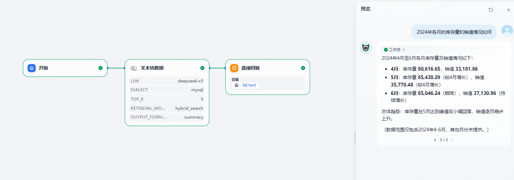

# SchemaRAG

**Author:** joto  
**Version:** 0.0.1  
**Type:** tool

---

## Description

This is a Dify plug-in for automatically analyzing database structures, building a knowledge base, and implementing natural language to SQL. It includes a node tool for natural language to SQL out of the box.

---

## ✨ Core Features

- **Multi-Database Support**: MySQL & PostgreSQL with automatic syntax adaptation
- **Schema Auto-Analysis**: One-click data dictionary generation with structure visualization
- **Knowledge Base Upload**: Automatic upload to Dify with incremental update support
- **Text2SQL**: Ready-to-use natural language to SQL conversion supporting complex queries
- **Security**: SELECT-only access with field whitelist support and minimum privilege principle
- **LLM Model Support**: Compatible with mainstream large language models

---

## Parameters

| Name             | Type   | Required | Description                    | Example               |
|------------------|--------|----------|--------------------------------|-----------------------|
| Dataset API Key  | secret | Yes      | Dify dataset API key           | dataset-xxx           |
| Database Type    | select | Yes      | Database type MySQL/PostgreSQL| MySQL                 |
| Database Host    | string | Yes      | Database host/IP               | 127.0.0.1             |
| Database Port    | number | Yes      | Database port                  | 3306/5432             |
| Database User    | string | Yes      | Database username              | root                  |
| Database Password| secret | Yes      | Database password              | ******                |
| Database Name    | string | Yes      | Database name                  | mydb                  |
| Dify Base URL    | string | No       | Dify API base URL              | <https://api.dify.ai/v1> |

---

## 🚀 Quick Start

### 1. Command Line

```bash
uv run main.py 
```

### 2. Dify Plugin Integration

Configure the above parameters in the Dify platform plugin configuration interface, save and drag into your workflow.

### 3. Code Example

```python
from provider.build_schema_rag import BuildSchemaRAG
builder = BuildSchemaRAG(
    dataset_api_key="your-key",
    db_type="MySQL",
    db_host="localhost",
    db_port=3306,
    db_user="root",
    db_password="password",
    db_name="your_db"
)
result = builder.toschema()
print(result)
```

---

## Screenshots





---

## FAQ

**Q: Which databases are supported?**  
A: Currently supports MySQL and PostgreSQL.

**Q: Is the data secure?**  
A: The plugin only reads database structure information to build the Dify knowledge base. Sensitive information is not uploaded.

---

## Contact

- Author: weijunjiang
- Email: <weijun.jiang@jototech.cn>

---

## License

MIT


