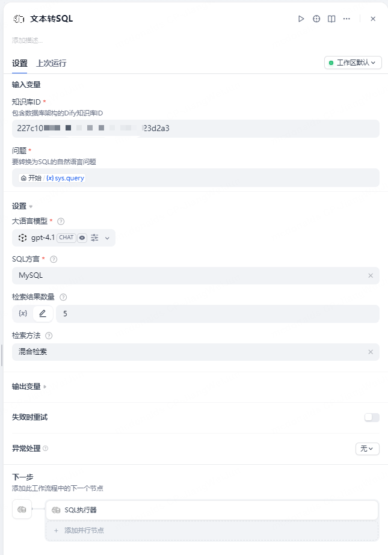

# SchemaRAG Database Schema RAG Plugin

[](https://github.com/weijunjiang123/schemarag)
[](https://www.python.org/)

**Author:** joto  
**Version:** 0.0.4  
**Type:** tool  
**Repository:** https://github.com/JOTO-AI/SchemaRAG-dify-plugin

---

## Overview

SchemaRAG is a database schema RAG plugin designed specifically for the Dify platform. It can automatically analyze database structures, build knowledge bases, and implement natural language to SQL queries. This plugin provides a complete database schema analysis and intelligent query solution, ready to use out of the box.

---

## ✨ Core Features

- **Multi-Database Support**: MySQL & PostgreSQL, automatic syntax adaptation
- **Schema Auto-Analysis**: One-click data dictionary generation, structure visualization
- **Knowledge Base Upload**: Automatic upload to Dify, supports incremental updates
- **Natural Language to SQL**: Ready to use out of the box, supports complex queries
- **Security Mechanism**: SELECT-only access, supports field whitelist, minimum privilege principle
- **Flexible Support**: Compatible with mainstream large language models

---

## 📋 Configuration Parameters

| Parameter Name    | Type   | Required | Description                    | Example                   |
|------------------|--------|----------|--------------------------------|---------------------------|
| Dataset API Key  | secret | Yes      | Dify knowledge base API key    | dataset-xxx               |
| Database Type    | select | Yes      | Database type MySQL/PostgreSQL | MySQL                     |
| Database Host    | string | Yes      | Database host/IP               | 127.0.0.1                 |
| Database Port    | number | Yes      | Database port                  | 3306/5432                 |
| Database User    | string | Yes      | Database username              | root                      |
| Database Password| secret | Yes      | Database password              | ******                    |
| Database Name    | string | Yes      | Database name                  | mydb                      |
| Dify Base URL    | string | No       | Dify API base URL              | `https://api.dify.ai/v1`  |

---

## 🚀 Quick Start

### Method 1: Command Line

```bash
uv run main.py 
```

### Method 2: Dify Plugin Integration

1. Fill in the above parameters in the Dify platform plugin configuration interface


2. After configuration is complete and accurate, click save to automatically build the configured database schema knowledge base in Dify

3. Add tools in the workflow and configure the knowledge base ID that was just created (the knowledge base ID is in the URL of the knowledge base page)


4. Provide SQL execution tool, input the generated SQL for direct execution, supports markdown and json output


### Method 3: Code Invocation

```python
from provider.build_schema_rag import BuildSchemaRAG

builder = BuildSchemaRAG(
    dataset_api_key="your-key",
    db_type="MySQL",
    db_host="localhost",
    db_port=3306,
    db_user="root",
    db_password="password",
    db_name="your_db"
)
result = builder.toschema()
print(result)
```

---

## 🛠️ Tool Components

### 1. text2sql Tool

By configuring database connections, automatically build database schema knowledge base. Connect the knowledge base in workflows to achieve text2sql functionality, ready to use out of the box.

### 2. sql_executer Tool

Provides secure interface for database query functionality in Dify workflows. Supports markdown and json output formats.

### 3. text2data Tool

Encapsulates the above two tools, ready to use out of the box, with added LLM summarization functionality to summarize query data into reports.

---

## ❓ FAQ

**Q: Which databases are supported?**  
A: Currently supports MySQL and PostgreSQL.

**Q: Is the data secure?**  
A: The plugin only reads database structure information to build Dify knowledge base. Sensitive information is not uploaded.

**Q: How to configure the database?**  
A: Configure database and knowledge base related information in the Dify plugin page. After configuration, it will automatically build the schema knowledge base in Dify.

**Q: How to use the text2sql tool?**  
A: After configuring the database and generating the schema knowledge base, you need to obtain the dataset_id from the generated knowledge base URL and fill it into the tool to specify the indexed knowledge base, and configure other information to use it.

---

## 📸 Example Screenshots


---

## 📞 Contact

- **Developer**: [Dylan Jiang](https://github.com/weijunjiang123)
- **Email**: <weijun.jiang@jototech.cn>

---

## 📄 License

Apache-2.0 license